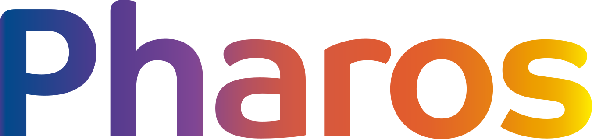

<!-- SYNC CONTRACT: Architecture changes require documentation updates. -->

<div align="center">



# Pharos

Design system da Alexandria — farol de orientação para produto, design e engenharia.

**Currently in Beta** · Built on [React](https://react.dev) and [StyleX](https://stylexjs.com)

[](https://www.npmjs.com/package/@pharos-ds/core)
[](LICENSE)
[](CONTRIBUTING.md)

[](https://pharos-ds.vercel.app)
[](https://pharos-ds.vercel.app)
[](https://pharos-ds.vercel.app)

**[Docs (placeholder)](https://pharos-ds.vercel.app)** · **[Contributing](CONTRIBUTING.md)**

</div>

## Overview

Pharos is the open source design system for Alexandria. It ships accessible React components, brand-level theming, dark mode, ready-to-ship templates, and a CLI — so people and AI assistants build the same way, from the same reference.

You import pre-built CSS and typed React components: no build plugin required for the default dist path.

**What makes Pharos different:**

- **Open internals.** Components are built to be composed at any level. When you need to go deeper, swizzle ejects a component's full source into your project.
- **No styling lock-in.** Styles are authored with StyleX, but that's invisible to consumers. Override with `className` using Tailwind, CSS modules, or plain CSS.
- **Customize without wrapping.** A theme is a set of CSS custom property overrides.
- **Built for people and agents.** API, docs, and CLI are designed together.

## Getting Started

```bash
# npm
npm install @pharos-ds/core @pharos-ds/theme-pharos
npm install -D @pharos-ds/cli

# pnpm
pnpm add @pharos-ds/core @pharos-ds/theme-pharos
pnpm add -D @pharos-ds/cli

# yarn
yarn add @pharos-ds/core @pharos-ds/theme-pharos
yarn add -D @pharos-ds/cli
```

See the **[@pharos-ds/core README](packages/core/README.md#quick-start)** for Next.js, Tailwind, Vite, and CDN setup.

For reliable CLI access, add a script to your `package.json`:

```json
"scripts": {
  "pharos": "node node_modules/@pharos-ds/cli/bin/pharos.mjs"
}
```

Then: `npm run pharos -- component --list`.

## Packages

| Package                                             | Description                                                   | README                                     |
| --------------------------------------------------- | ------------------------------------------------------------- | ------------------------------------------ |
| [`@pharos-ds/core`](packages/core)                  | Components, theme system, and utilities                       | [README](packages/core/README.md)          |
| [`@pharos-ds/cli`](packages/cli)                    | CLI: component docs, templates, scaffolding, themes, codemods | [README](packages/cli/README.md)           |
| [`@pharos-ds/build`](packages/build)                | Build plugins for StyleX source builds                        | [README](packages/build/README.md)         |
| [`@pharos-ds/theme-pharos`](packages/themes/pharos) | Official Alexandria / Pharos theme                            | [README](packages/themes/pharos/README.md) |

> Other themes under `packages/themes/` are kept for internal experiments and are not part of the public v1 publish set. `@pharos-ds/lab`, `@pharos-ds/vega`, and `@pharos-ds/charts` remain private / canary.

## Project Structure

| Directory   | Purpose                                      |
| ----------- | -------------------------------------------- |
| `apps/`     | Example apps, docsite, and Storybook         |
| `packages/` | Published packages: core, cli, build, themes |
| `internal/` | Internal tooling                             |
| `brand/`    | Alexandria brand assets (logo + slogan SVGs) |

## Attribution

Pharos is based on [Astryx](https://github.com/facebook/astryx) (Meta), licensed under MIT. See [NOTICE](NOTICE) and [LICENSE](LICENSE). **Not affiliated with Meta or Astryx.**

## Contributing

See **[CONTRIBUTING.md](CONTRIBUTING.md)**.

```bash
corepack enable
pnpm install
```

Requires **Node 22+** (active LTS) and **pnpm 11**.

## License

MIT — Copyright (c) Caio Silvestre; portions Copyright (c) Meta Platforms, Inc. (Astryx).
